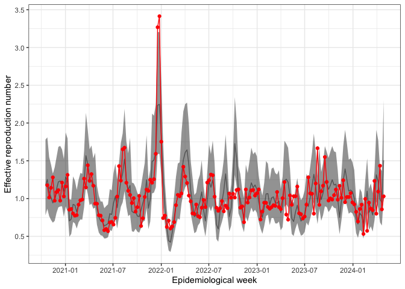
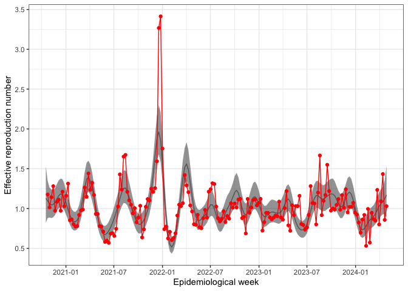

<!-- README.md is generated from the README.Rmd. Please edit that file -->

# Ontario epidemic curve reconstruction

This is the code to replicate the results in Section 3 of the
manuscript.

Start by running the script **1_1_wastewatermodel_ON.R** to fit the
wastewater model. For more information on the wastewater model, please
see <https://doi.org/10.1093/jrsssc/qlae073> and
<https://github.com/emilysomerset/wastewater_paper_code>.

For the remainder of the analysis, you will need the following
libraries. The R version used for this analysis and the package versions
are listed below.

``` r
# > sessionInfo()
# R version 4.4.1 (2024-06-14)
# Platform: aarch64-apple-darwin20
# Running under: macOS Monterey 12.4

# R version 4.4.2 (2024-10-31)
# Platform: x86_64-pc-linux-gnu
# Running under: Ubuntu 22.04.5 LTS

library(dplyr) # dplyr_1.1.4
library(TMB) # TMB_1.9.16
library(magrittr) # magrittr_2.0.3
library(reshape2) # reshape2_1.4.4
library(gridExtra) # gridExtra_2.3
library(cowplot) # cowplot_1.1.3
library(lubridate) # lubridate_1.9.4
library(ggplot2) # ggplot2_3.5.1
```

You will need to source the following functions, provided in this
folder.

``` r
source('../functions_general/prep_data_covid_with_fittedwastewater.R')
source('../functions_general/process_results_epidemic.R')
```

Compile and load the following C++ file

``` r
compile(file="../section_3/cpp/model4.cpp")
```

    ## [1] 0

``` r
try(dyn.unload(dynlib("../section_3/cpp/model4")),silent = TRUE)
dyn.load(dynlib("../section_3/cpp/model4"))
```

## Data and data preparation

``` r
load("../section_3/data/work_d_toronto_2024_08_08.RData") # Public health ontario covid cases
load("../section_3/data/work_d_pho_testing_2024_10_07.RData") # Public health ontario testing
load(file="../section_3/results_model_ON_phachist.RData") # from the wastewater model

work_d_toronto <- work_d_toronto %>% 
  left_join(work_d_testing %>% 
              dplyr::select(week_end_date, total_number_of_tests) %>% 
              mutate(week_end_date = ymd(week_end_date)), 
            by = c("earliest_week_end_date"="week_end_date"))

# bring in hospital data too

load("../section_3/data/work_d_pho_hosp_cases_2024_10_07.RData")
load("../section_3/data/work_d_toronto_hosp_cases_2024_09_05.RData")

work_d_toronto <- work_d_toronto %>% 
  left_join(work_d_hosp2 %>% 
              filter(outcome == "COVID-19 hospital admissions (up to January 20, 2024)") %>% 
              dplyr::select(week_end_date, number) %>% 
              mutate(week_end_date = ymd(week_end_date)) %>% 
              rename("admissions" = number), 
            by = c("earliest_week_end_date"="week_end_date")) %>% 
    left_join(work_d_hosp2 %>% 
                filter(outcome == "COVID-19 deaths") %>% 
                dplyr::select(week_end_date, number,population) %>% 
                mutate(week_end_date = ymd(week_end_date)) %>% 
                rename("deaths" = number),
            by = c("earliest_week_end_date"="week_end_date")) %>% 
      left_join(work_d_hosp %>% 
              dplyr::select(episode_week, hospitalized_cases) %>% 
              mutate(episode_week = ymd(episode_week)), 
            by = c("week_start_date"="episode_week"))

# These weights are from 
# https://www.toronto.ca/wp-content/uploads/2023/10/8e9f-PublicHealthWastewaterSurveillanceTechNotes.pdf
weights_datadic = data.frame(site_id = c("TAB","THC","THU","TNT"), 
                             weight = c(0.499/(0.177+0.232+0.064+0.499),
                                        0.177/(0.177+0.232+0.064+0.499),
                                        0.232/(0.177+0.232+0.064+0.499),
                                        0.064/(0.177+0.232+0.064+0.499)))

data_foranalysis_full <- prep_data(case_data = work_d_toronto,
                                   y_var = "number_of_cases",
                                   results = results,
                                   AR=TRUE,
                                   weight_ratio = TRUE,
                                   weights_datadic = weights_datadic)

pop <- work_d_toronto %>% 
  filter(earliest_week_end_date < mdy("09-30-2020")) %>% slice(1) %$% population[1]
```

    ## `summarise()` has grouped output by 'earliest_week_end_date'. You can override
    ## using the `.groups` argument.

<!-- --><!-- -->
