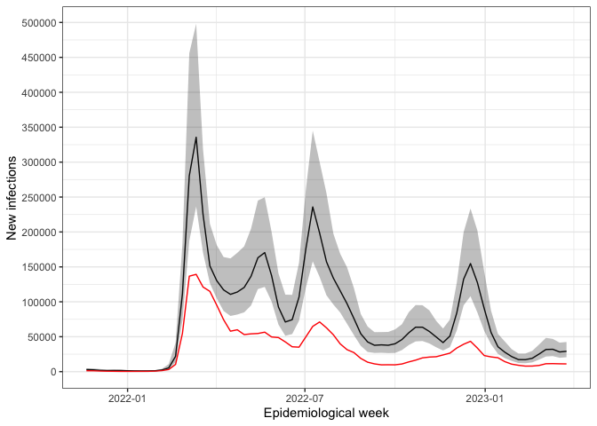

<!-- README.md is generated from the README.Rmd. Please edit that file -->

# New Celand epidemic curve reconstruction

This is the code to replicate the results in Section 4 of the
manuscript.

Start by running the script **1_1_wastewatermodel_NZ.R** to fit the
wastewater model. For more information on the wastewater model, please
see <https://doi.org/10.1093/jrsssc/qlae073> and
<https://github.com/emilysomerset/wastewater_paper_code>.

For the remainder of the analysis, you will need the following
libraries. The R version used for this analysis and the package versions
are listed below.

``` r
# > sessionInfo()
# R version 4.4.1 (2024-06-14)
# Platform: aarch64-apple-darwin20
# Running under: macOS Monterey 12.4

# R version 4.4.2 (2024-10-31)
# Platform: x86_64-pc-linux-gnu
# Running under: Ubuntu 22.04.5 LTS

library(dplyr) # dplyr_1.1.4
library(TMB) # TMB_1.9.16
library(magrittr) # magrittr_2.0.3
library(reshape2) # reshape2_1.4.4
library(gridExtra) # gridExtra_2.3
library(cowplot) # cowplot_1.1.3
library(lubridate) # lubridate_1.9.4
library(ggplot2) # ggplot2_3.5.1
library(zoo) #zoo_1.8-12
library(readr) # readr_2.1.5
```

You will need to source the following function and data, provided in
this folder.

``` r
load("../section_4/data/cases_weekly_new_zealand.RData")
load(file="../section_4/results_model_NZ.RData")
source("../functions_general/prep_data_covid_with_fittedwastewater.R")
source('../functions_general/process_results_epidemic.R')
```

Compile and load the following C++ file

``` r
compile(file="../section_4/cpp/model4.cpp")
```

    ## [1] 0

``` r
try(dyn.unload(dynlib("../section_4/cpp/model4")),silent = TRUE)
dyn.load(dynlib("../section_4/cpp/model4"))
```

## Prep data

``` r
sites <- read_csv("../section_4/data/sites.csv")
sites <- sites %>% 
  dplyr::select(SampleLocation, Region, Population) %>% 
  rename("site_id"= SampleLocation,
         "weight"=Population)

sites2 <- sites %>% 
  group_by(Region) %>% 
  mutate(region_weight = sum(weight)) %>% 
  mutate(region_weight = ifelse(Region == "Auckland", region_weight-weight[which(site_id == "AU_Mangere")], region_weight)) %>% 
  mutate(weight = ifelse(site_id == "AU_Mangere", 1.716*1000000- region_weight, weight))

data_foranalysis <- prep_data(case_data = cases_epiweekly,
                              y_var = "number_of_cases",
                              results = results,
                              AR = TRUE,
                              weight_ratio = FALSE,
                              weights_datadic = sites2,
                              date_forfilter_strict_upr = ymd("2023-03-31"))
```

## Fit model

``` r
MI_models <- list(NULL)

set.seed(2917)
ss <- sample(1:3000,500)
for (i in 1:length(ss)){

  tmbdat <- data_foranalysis$tmbdat[[ss[i]]]
  tmbdat$case_counts <- c(tmbdat$obs_start_case, tmbdat$case_counts)
  tmbdat$ratio <- c(1, tmbdat$ratio_v_u_fixed)
  tmbdat$lag = 0
  tmbdat$u1 = 1
  tmbdat$alpha1 = 0.5 #median
  tmbdat$mean_z0 = tmbdat$obs_start_case
  tmbdat$sd_z0 = 500
  
  tmbparams <- list(
    W = c(rep(0, length(tmbdat$case_counts)-tmbdat$lag), 
          rep(400,length(tmbdat$case_counts)-tmbdat$lag)), # W = c(U,beta,Z); 
    theta_p=1
  )
  
  
  ff <- TMB::MakeADFun(
    data = tmbdat,
    parameters = tmbparams,
    random = "W",
    DLL = "model4",
    silent = TRUE
  )
  
  aghq_k = 10
  
  mdl1 <- aghq::marginal_laplace_tmb(ff,k=aghq_k,startingvalue = c(1))
  samps1 <- aghq::sample_marginal(mdl1, M = 3000) 
  
  MI_models[[i]] <- samps1
  print(i)
}

save(file="../section_4/results_popweighted/results_NZ_v_u_fixed.RData", list = "MI_models")
```

## Process the results

``` r
load("../section_4/results_popweighted/results_NZ_v_u_fixed.RData")
results <- process_results(data_foranalysis = data_foranalysis,
                MI_models = MI_models,
                full_timeseries = FALSE,
                adj = FALSE)
```

## Plot the results

### Ascertainment probability

    ## # A tibble: 71 × 28
    ##    earliest_week_start_date dow       y earliest_week_end_date dow2  ratio_cases
    ##    <date>                   <ord> <dbl> <date>                 <ord>       <dbl>
    ##  1 2021-11-14               Sun    1327 2021-11-20             Sat         1.11 
    ##  2 2021-11-21               Sun    1269 2021-11-27             Sat         0.956
    ##  3 2021-11-28               Sun     917 2021-12-04             Sat         0.723
    ##  4 2021-12-05               Sun     684 2021-12-11             Sat         0.746
    ##  5 2021-12-12               Sun     539 2021-12-18             Sat         0.788
    ##  6 2021-12-19               Sun     410 2021-12-25             Sat         0.761
    ##  7 2021-12-26               Sun     395 2022-01-01             Sat         0.963
    ##  8 2022-01-02               Sun     407 2022-01-08             Sat         1.03 
    ##  9 2022-01-09               Sun     428 2022-01-15             Sat         1.05 
    ## 10 2022-01-16               Sun     465 2022-01-22             Sat         1.09 
    ## # ℹ 61 more rows
    ## # ℹ 22 more variables: index_start <int>, Y0 <dbl>, ratio_v_u <dbl>,
    ## #   ratio_v_u_fixed <dbl>, row_id <int>, p_med <dbl>, p_upr <dbl>, p_lwr <dbl>,
    ## #   z_med <dbl>, z_upr <dbl>, z_lwr <dbl>, y_med <dbl>, y_upr <dbl>,
    ## #   y_lwr <dbl>, z_cumsum_noadj_med <dbl>, z_cumsum_noadj_upr <dbl>,
    ## #   z_cumsum_noadj_lwr <dbl>, z_cumsum_noadj_delta_med <dbl>,
    ## #   z_cumsum_noadj_delta_upr <dbl>, z_cumsum_noadj_delta_lwr <dbl>, …


### Weekly new infection counts

<!-- -->
